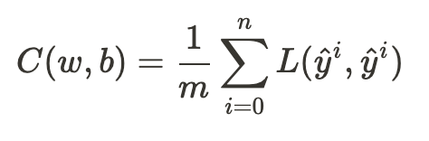

# Learning

Learning is the process by which a neural network _adapts_ to minimize the cost of its fit.

## Loss Functions

Define how poorly a given model fits. A good model has a loss function value approaching zero.

For gradient descent, you want there to be one minima *at* the label value. See [Desmos](https://www.desmos.com/calculator/desmzbmxbh).

### Square Error

`L(y,y') = c(y - y')^2` where `c` is a scalar.

### Logistic Regression

`L(y,y') = -(ylog(y') + (1 - y)log(1 - y'))`

Reasoning:

For `y = 1`, `L(1,y') = -log(y')`

For `y = 0`, `L(0,y') = -log(1 - y')`

## Loss Function Design

TODO: Consider convexity and optima

### Loss vs Cost

Loss is for one training datum and prediction. Cost is the average across all training data, and is applied to the parameters themselves.

## Propagation

Forward - compute the output

Backward - compute partial derivatives and perform gradient descent

## Algorithms/Strategies

Gradient Descent: alteration of parameters `w` and `b` to minimize the cost function `C(w,b)` by changing each component of `w|b` according to the partial derivative of `C` with respect to the component.
## Supervised Learning

TODO.

## Deep Learning

Many, many hidden layers. Greater abstraction.