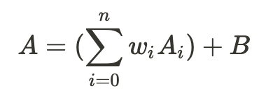

# Neural Networks

Chained mathematical functions, organized typically in layers.

## Neural Network Structure

### Weights and Biases

Each neuron's activation `A` is the sum of each neuron's activation in the previous layer `A_i` scaled by some weight vector `w`, plus some bias `B`.

## Activation Functions

Activation functions determine how a neuron's activation is 'filtered', i.e. `f(A)`.

- **ReLU** (**Re**ctified **L**inear **U**nits): `y = min(0, cx)` where `c` is a scalar;
- **Sigmoid**: `y = 1/(1 + e^-x)`, slow learning as `|x|>1`; gradient shrinks to zero (solved by ReLU)

### Layers

- Input layer: `x`, no preceding layers;
- "Hidden" layers: All layers between input and output, arbitrary/no "real" meaning, purely mathematical;
- Output layer: `y`, no subsequenet layers;

### Types of Neural Networks

**Convolutional NN**: Useful for image data.

**Recurrent NN**: Useful for one-dimensional/sequence data, i.e. text, voice.

**Support Vector Machine** (SVM): TODO

## Types of Algorithms

### Logistic Regression

An algorithm for *binary classification* (output labels `y` are all either 0 or 1). Predictions are 'slider' probabilities, i.e. between 0 and 1, where `y' = sig(Wx+b)`. Sigmoid is used because this allows very large positive or negative numbers to become very close to 1 or 0 respectively.

### NN Algorithm Design

Consider valid output ranges. TODO